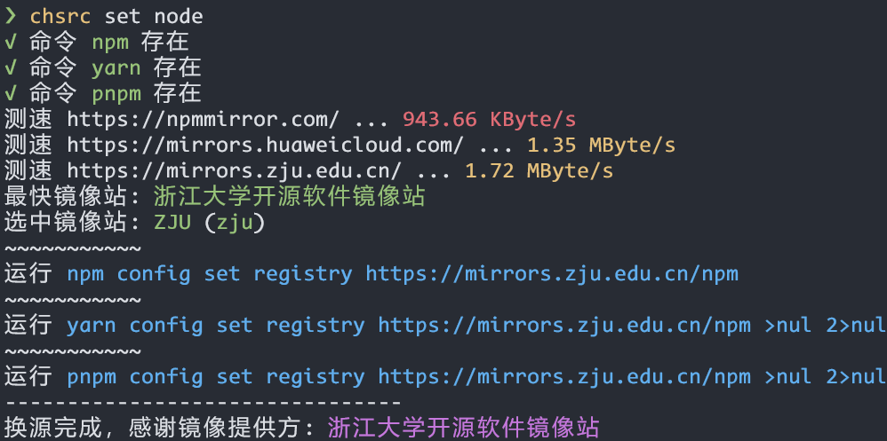

<div align="center">
  
</div>

全平台命令行换源工具，**目标支持 Linux, Windows, macOS, BSD 等尽可能多的操作系统，龙芯、飞腾、RISC-V 等尽可能多的 CPU**。

我们使用 **C99** 来完成上述目标。我们并不使用 Python 或 JS 等解释语言，因为一个简单的换源工具，不应该强行塞给用户一个庞大的解释器和数十、数百 MB 其他文件。

本软件为**自由软件**，SDPX 软件许可证为 `GPL-3.0-or-later and MIT`

<br>

## 🤝 贡献

> [!TIP]
> **`chsrc` 不仅是一个命令行工具，同时也是一个换源框架，它甚至使你能够在不了解C语言的情况下编写出新的换源方法(recipe)。**

立刻为一个新软件添加换源方法！[Write A Recipe Even If You Don't Know C](./doc/Write-A-Recipe-Even-If-You-Dont-Know-C.md)

- 案例：[Armbian](./src/recipe/os/APT/Armbian.c)
- 挑战：[CentOS (Stream) Recipe Challenge!](https://github.com/RubyMetric/chsrc/issues/48)

<br>

> [!NOTE]
> 想通过 `flatpak`, `yay`,`pacman`,`apt`,`dnf` 等系统包管理工具来安装和更新`chsrc`？若您可提供维护，请访问 [issue#16 on GitHub](https://github.com/RubyMetric/chsrc/issues/16)

- [x] `Homebrew`
- [x] `Scoop`
- [ ] `Flatpak`
- [ ] `AUR`
- [ ] 缺乏其他平台/包维护者

<br>

## 📌 示例

<div align="center">
  
</div>

<br>

## 🚀 安装

<a href="https://repology.org/project/chsrc/versions">
    
</a>

> [!IMPORTANT]
> 若通过下述手动方式安装，则会下载到当前目录，可直接通过 `./chsrc` 运行

<details>
<summary>Windows</summary>

- 可通过 `scoop` 安装，感谢 [@Gn3po4g](https://github.com/Gn3po4g) 与 [@niheaven](https://github.com/niheaven)

```bash
$ scoop install chsrc
```

- 或手动下载二进制文件，这是最新版，往往比 `scoop` 提供的更新，适用于修复 Bug、添加新功能后及时使用，以及未安装 `scoop` 时

```bash
# x64
curl -L https://gitee.com/RubyMetric/chsrc/releases/download/pre/chsrc-x64-windows.exe -o chsrc.exe

# x86
curl -L https://gitee.com/RubyMetric/chsrc/releases/download/pre/chsrc-x86-windows.exe -o chsrc.exe
```
</details>

<details>
<summary>Linux</summary>

```bash
# x64
curl -L https://gitee.com/RubyMetric/chsrc/releases/download/pre/chsrc-x64-linux -o chsrc; chmod +x ./chsrc

# aarch64
curl -L https://gitee.com/RubyMetric/chsrc/releases/download/pre/chsrc-aarch64-linux -o chsrc; chmod +x ./chsrc

# riscv64
curl -L https://gitee.com/RubyMetric/chsrc/releases/download/pre/chsrc-riscv64-linux -o chsrc; chmod +x ./chsrc

# armv7
curl -L https://gitee.com/RubyMetric/chsrc/releases/download/pre/chsrc-armv7-linux -o chsrc; chmod +x ./chsrc
```
</details>

<details>
<summary>macOS</summary>

- 可通过 `homebrew` 安装，感谢 [@Aaron-212](https://github.com/Aaron-212) 与 [@chenrui333](https://github.com/chenrui333)

```bash
$ brew install chsrc
```

- 或手动下载二进制文件，这是最新版，往往比 `homebrew` 提供的更新，适用于修复 Bug、添加新功能后及时使用

```bash
# arm/aarch64
curl -L https://gitee.com/RubyMetric/chsrc/releases/download/pre/chsrc-aarch64-macos -o chsrc; chmod +x ./chsrc

# x64
curl -L https://gitee.com/RubyMetric/chsrc/releases/download/pre/chsrc-x64-macos -o chsrc; chmod +x ./chsrc
```
</details>

<details>
<summary>BSD</summary>

```bash
git clone https://gitee.com/RubyMetric/chsrc.git; cd chsrc
clang -Iinclude src/chsrc.c -o chsrc
```
</details>

<details>
<summary>其他平台</summary>

```bash
git clone https://gitee.com/RubyMetric/chsrc.git; cd chsrc; make
```
</details>

<br>

## 💡 使用

```bash
使用: chsrc <command> [options] [target] [mirror]

help                      # 打印此帮助，或 h, -h, --help
issue                     # 查看相关issue

list (或 ls, 或 l)        # 列出可用镜像源，和可换源目标
list mirror/target        # 列出可用镜像源，或可换源目标
list os/lang/ware         # 列出可换源的操作系统/编程语言/软件

measure <target>          # 对该目标所有源测速
cesu    <target>

list <target>             # 查看该目标可用源与支持功能
get  <target>             # 查看该目标当前源的使用情况

set  <target>             # 换源，自动测速后挑选最快源
set  <target>  first      # 换源，使用维护团队测速第一的源
set  <target> <mirror>    # 换源，指定使用某镜像站 (通过list命令查看)
set  <target> https://url # 换源，用户自定义源URL
reset <target>            # 重置，使用上游默认使用的源

选项:
-dry                      # Dry Run，模拟换源过程，命令仅打印并不运行
-ipv6                     # 使用IPv6测速
-local                    # 仅对某项目而非全局换源 (仅部分软件如bundler,pdm支持)
```

当你**不想自动测速的时候**，你可以直接指定某镜像站，源URL，以及指定维护团队已测试的最快镜像站。

```bash
chsrc set ruby           # 测速，寻找最快者，换源
# 或
chsrc ls  ruby           # 列出可用的镜像站
chsrc set ruby rubychina # 使用 RubyChina 作为镜像站
# 或您有自己的镜像地址
chsrc set ruby https://gems.ruby-china.com/ # 使用自定义URL
# 或
chsrc set ruby first     # 使用维护团队测试的最快镜像站
```

对支持 **项目级** 换源的目标，可以避免全局（**系统级** 或 **用户级**）换源。

```bash
chsrc set -local bundler
chsrc set -local pdm
```

<br>

## 编程语言开发

```bash
chsrc set ruby    或 gem
chsrc set python  或 pip / poetry / pdm # 同时换pip、poetry 和 pdm 这3个
chsrc set node    或 npm / nodejs / yarn / pnpm # 同时换npm, yarn 和 pnpm 这3个
chsrc set perl    或 cpan
chsrc set php     或 composer
chsrc set lua     或 luarocks

chsrc set go
chsrc set rust    或 cargo / crate
chsrc set java    或 maven / mvn / gradle
chsrc set clojure 或 clojars
chsrc set dart    或 pub / flutter # 同时会为flutter换源
chsrc set haskell 或 hackage/cabal/stack
chsrc set ocaml   或 opam

# 同时会为 bioconductor 换源
chsrc set r       或 cran
chsrc set julia
```

<br>

## 操作系统

```bash
sudo chsrc set ubuntu
sudo chsrc set linuxmint 或 mint
sudo chsrc set debian
sudo chsrc set fedora
sudo chsrc set suse  或 opensuse
sudo chsrc set kali
sudo chsrc set arch
sudo chsrc set archlinuxcn
sudo chsrc set manjaro
sudo chsrc set gentoo
sudo chsrc set rocky 或 rockylinux
sudo chsrc set alma  或 almalinux
sudo chsrc set alpine
sudo chsrc set void  或 voidlinux
sudo chsrc set solus
sudo chsrc set ros   或 ros2
sudo chsrc set trisquel
sudo chsrc set lite  或 linuxlite
sudo chsrc set raspi 或 raspberrypi
sudo chsrc set armbian
sudo chsrc set openwrt

sudo chsrc set openeuler
sudo chsrc set openanolis 或 anolis
sudo chsrc set openkylin
sudo chsrc set deepin

chsrc set msys2 或 msys

# BSD
sudo chsrc set freebsd
sudo chsrc set openbsd
sudo chsrc set netbsd
```

<br>

## 软件

```bash
chsrc set winget
chsrc set brew      或 homebrew
chsrc set cocoapods 或 cocoa / pod
chsrc set dockerhub 或 docker
chsrc set flathub   或 flatpak
chsrc set nix
chsrc set guix
chsrc set emacs  或 elpa
chsrc set tex    或 ctan / latex / texlive / miktex
chsrc set conda  或 anaconda
```

<br>

## 🛠️ 开发

请安装好 `gcc`或`clang` 和 `make` 以及 `curl`

```bash
# 使用 dev 分支开发
git clone https://gitee.com/RubyMetric/chsrc.git -b dev

make          # 默认使用 cc 编译
make CC=clang # 使用 clang 编译
make CC=gcc   # 使用 gcc   编译

make test    # 测试命令
make test-xy # 测试 xy.h
make clean
```

<br>

## 📝 许可证

- `chsrc` 主程序采用 `GPL-3.0-or-later` 许可证，保证该软件的永久自由
- `xy.h` 使用 `MIT` 许可证，保证该库可以在尽可能多的情况下复用

<br>

## ❤️ 致谢

感谢各个镜像站提供的优质免费镜像服务
1. [source.h](./include/source.h) 包含了通用的镜像站信息
2. 各个recipe内部定义的专用镜像站

另外感谢以下项目:

1. [MirrorZ 教育网镜像站](https://help.mirrors.cernet.edu.cn/)
2. [清华大学 Tuna](https://mirrors.tuna.tsinghua.edu.cn/)
3. [Thanks Mirror 项目](https://github.com/eryajf/Thanks-Mirror) by [@eryajf](https://github.com/eryajf)

<br>
