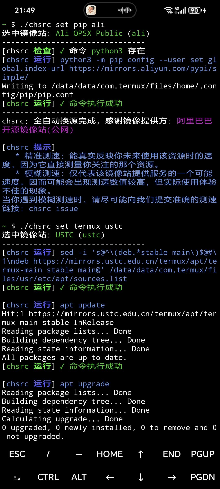

<!-- -----------------------------------------------------------
 ! SPDX-License-Identifier: GFDL-1.3-or-later
 ! -------------------------------------------------------------
 ! Doc Type      : Markdown
 ! Doc Name      : README.md
 ! Doc Authors   : Aoran Zeng  <ccmywish@qq.com>
 ! Contributors  : Mikachu2333 <mikachu.23333@zohomail.com>
 !               |
 ! Created On    : <2023-12-28>
 ! Last Modified : <2025-08-17>
 ! ---------------------------------------------------------- -->

<div align="center">
  
</div>

全平台通用换源工具与框架 `chsrc`，**目标支持 Linux, Windows (native, MSYS2, Cygwin), macOS, BSD, Android 等尽可能多的操作系统环境，龙芯、飞腾、RISC-V 等尽可能多的 CPU**。

我们使用 **C11** 来完成上述目标。我们并不使用 Python 或 JavaScript 等解释语言，因为一个简单的换源工具，不应该强行塞给用户一个庞大的解释器和数十、数百 MB 其他文件。

本软件为**自由软件**，SDPX 软件许可证为 `GPL-3.0-or-later and MIT`

<br>


<table align="center">
  <tr>
  <td>
    <a href="https://trendshift.io/repositories/10744" target="_blank"></a>
  </td>
  <td>
    <a href="https://hellogithub.com/repository/7666ba91e01e4a59be5809b02d9e8ff6" target="_blank"></a>
  </td>
  </tr>
</table>

<br>


## ❤️ 致所有的朋友们

2025年8月11日，我因通宵重构本项目代码而被送去抢救（[#252](https://github.com/RubyMetric/chsrc/issues/252)，[突发！换源工具 chsrc 作者在重构过程中被送去 120 抢救](https://v2ex.com/t/1151802)）。大家给予的关心和帮助让我非常非常感动！在此，我衷心感谢每一位朋友！**无论是开源还是闭源，无论是否为职业程序员，我们其实都是一群使用软件、热心互助、充满友爱的人，这是一个温暖的大家庭**。

我为 `chsrc` 采用 GPL 协议，怀着殷切的期望：**希望能够营造像 Richard Stallman 在创建 GNU 项目之前，在 MIT 那样的氛围——写自己用得上的软件，与大家一起开发、维护，简单纯粹，无关商业利益。就像小区、校园自发组建的足球篮球队，从一次偶然的加入，逐渐成长为互相支持的伙伴**。

这次经历让我更加深刻地体会到：开源，是一种把大家联系在一起的方式，**它让友情、互助和协作成为可能，也让我们在共同的目标中建立起长期的纽带**。

最后，希望大家能够**时刻关注**自己的身体，**你可以随时 `chsrc` `chown` `chgrp` `chmod` 无限次，但是无法 `chbody`**！

<br>


## 🤝 协作与贡献

> [!TIP]
> **`chsrc` 不仅是一个命令行工具，同时也是一个体现了 Ruby on Rails 思想的 MVC 换源框架，它甚至使你能够在不了解C语言的情况下编写出新的换源方法 (recipe)。** 配合使用 [rawstr4c], 这将比写 shell 脚本更加轻松。 [如何编写 recipe?](./doc/10-如何编写recipe.md)

---

> [!NOTE]
> 这也许是你可以参与的第一个现实世界中有用的C语言项目，[用 VS Code 一分钟内上手编译、运行、测试 chsrc](./doc/01-开发与构建.md)
>
> 欢迎对 GitHub、Gitee 协作不熟悉的人以此为契机学习参与贡献, 欢迎任何编程初学者。[从开发到提交PR，我们覆盖全流程文档](./doc/)
---

> [!IMPORTANT]
> **`chsrc` 可换源 65+ 目标。每个人仅仅贡献和维护自己熟悉的部分，回报是得到其他所有领域专家的帮助。** [欢迎成为 recipe 维护者](https://github.com/RubyMetric/chsrc/issues/130)

<br>

可参与的任务与挑战：

1. [Shell auto-completion 终端命令自动补全](https://github.com/RubyMetric/chsrc/issues/204)

2. [搜集默认源地址，帮助使用 `reset` 功能](https://github.com/RubyMetric/chsrc/issues/111)

3. [搜集测速地址，进行精准测速](https://github.com/RubyMetric/chsrc/issues/205)

4. [chsrc-bootstrap: 为不存在预编译 `chsrc` 的平台提供支持](https://github.com/RubyMetric/chsrc/issues/230)

<br>

<details>
<summary>已由贡献者完成的挑战</summary>

1. [[Challenge] 编写统一安装的 shell 和 PowerShell 脚本](https://github.com/RubyMetric/chsrc/issues/98)

    已由 [@Efterklang] 与 [@wickdynex] 完成

</details>

<details>
<summary>镜像站可用性</summary>

1. <https://github.com/RubyMetric/chsrc/wiki>
2. <https://github.com/RubyMetric/chsrc/discussions>

</details>

<details>
<summary>打包</summary>

想通过 `dnf`, `flatpak`, `snap` 等系统包管理工具来安装和更新`chsrc`？若可提供维护，请访问 [issue#16 on GitHub](https://github.com/RubyMetric/chsrc/issues/16)

- [x] `Homebrew`
- [x] `Scoop`
- [x] `WinGet`
- [x] `AUR`
- [ ] `Flatpak`
- [ ] `snap`
- [ ] 缺乏其他平台/包维护者

</details>

<br>


## 📌 示例

桌面端:

<div align="center">
  
</div>

<br>

安卓:

<div align="center">
  
</div>

<br>


## 🚀 安装

<a href="https://repology.org/project/chsrc/versions">
  
</a>

> [!IMPORTANT]
> 若通过下述手动方式安装，则会下载到当前目录，可直接通过 `./chsrc` 运行

<details>
<summary>Windows</summary>

- 可通过 `scoop` 安装，感谢 [@Gn3po4g] 与 [@niheaven]

```bash
scoop install chsrc
```

<br>

- 可通过 `WinGet` 安装，感谢 [@YU-7]

```bash
winget install RubyMetric.chsrc
```

<br>

- 可通过 `PowerShell` 脚本一键下载最新版二进制文件，感谢 [@wickdynex]

    若下方链接无法访问，可使用 `https://gitee.com/RubyMetric/chsrc/raw/main/tool/installer.ps1` 替代

```PowerShell
# 使用 -Version 指定版本 (不指定时默认为 pre)
#   1. 安装 pre 版本; 这比从包管理器安装的总是更新一些
#   2. 安装旧版本; 有时新版本可能引入某些 Bug，临时使用旧版本解决燃眉之急
"& { $(iwr -useb https://chsrc.run/windows) } -Version pre" | iex
```

<br>

- 或手动下载二进制文件，这是最新版，往往比 `scoop` 提供的更新，适用于修复 Bug、添加新功能后及时使用，以及未安装 `scoop` 时

```bash
# x64
curl -L https://gitee.com/RubyMetric/chsrc/releases/download/pre/chsrc-x64-windows.exe -o chsrc.exe

# x86
curl -L https://gitee.com/RubyMetric/chsrc/releases/download/pre/chsrc-x86-windows.exe -o chsrc.exe
```

</details>


<details>
<summary>Linux</summary>

- 可通过 `apt`/`dpkg` 安装，感谢 [@sanchuanhehe]

```bash
# x64
$ curl -LO https://gitee.com/RubyMetric/chsrc/releases/download/pre/chsrc_latest-1_amd64.deb

# 也可以使用 Wget
wget https://gitee.com/RubyMetric/chsrc/releases/download/pre/chsrc_latest-1_amd64.deb

$ sudo apt install ./chsrc_latest-1_amd64.deb
# 或
$ sudo sudo dpkg -i chsrc_latest-1_amd64.deb
```

<br>

- 支持 `AUR`，可通过 `yay` 安装，感谢 [@Jerry-Terrasse]

```bash
# AUR
$ yay -S chsrc-bin # Binary from GitHub Release
$ yay -S chsrc-git # Build  from the latest main branch (stable)
$ yay -S chsrc     # Build  from GitHub Release
```

<br>

- 可通过 `shell` 脚本一键安装最新版，感谢 [@Efterklang] 与 [@wickdynex]

    若下方链接无法访问，可使用 `https://gitee.com/RubyMetric/chsrc/raw/main/tool/installer.sh` 替代

```bash
# 非root用户默认安装至 ~/.local/bin
$ curl https://chsrc.run/posix | bash

# 也可以使用 Wget
$ wget -O - https://chsrc.run/posix | bash

# root用户默认安装至 /usr/local/bin
$ curl https://chsrc.run/posix | sudo bash

# 使用 -d 指定目录安装
$ curl https://chsrc.run/posix | bash -s -- -d ./

# 使用 -v 指定版本 (不指定时默认为 pre)
#   1. 安装 pre 版本; 这比从包管理器安装的总是更新一些
#   2. 安装旧版本; 有时新版本可能引入某些 Bug，临时使用旧版本解决燃眉之急
$ curl https://chsrc.run/posix | bash -s -- -v 0.2.1

# 使用 -l en 输出英文
$ curl https://chsrc.run/posix | bash -s -- -l en
```

<br>

- 可手动下载二进制文件安装

```bash
# x64
curl -L https://gitee.com/RubyMetric/chsrc/releases/download/pre/chsrc-x64-linux -o chsrc; chmod +x ./chsrc

# aarch64
curl -L https://gitee.com/RubyMetric/chsrc/releases/download/pre/chsrc-aarch64-linux -o chsrc; chmod +x ./chsrc

# riscv64
curl -L https://gitee.com/RubyMetric/chsrc/releases/download/pre/chsrc-riscv64-linux -o chsrc; chmod +x ./chsrc

# armv7
curl -L https://gitee.com/RubyMetric/chsrc/releases/download/pre/chsrc-armv7-linux -o chsrc; chmod +x ./chsrc
```

如果你所在的处理器架构没有预编译版本，可以使用 [chsrc-bootstrap]

</details>


<details>
<summary>macOS</summary>

- 可通过 `homebrew` 安装，感谢 [@Aaron-212] 与 [@chenrui333]

```bash
brew install chsrc
```

<br>

- 可通过 `shell` 脚本安装最新版，感谢 [@Efterklang] 与 [@wickdynex]

    若下方链接无法访问，可使用 `https://gitee.com/RubyMetric/chsrc/raw/main/tool/installer.sh` 替代

```bash
# 非root用户默认安装至 ~/.local/bin
$ curl https://chsrc.run/posix | bash

# root用户默认安装至 /usr/local/bin
$ curl https://chsrc.run/posix | sudo bash

# 使用 -d 指定目录安装
$ curl https://chsrc.run/posix | bash -s -- -d ./

# 使用 -v 指定版本 (不指定时默认为 pre)
#   1. 安装 pre 版本; 这比从包管理器安装的总是更新一些
#   2. 安装旧版本; 有时新版本可能引入某些 Bug，临时使用旧版本解决燃眉之急
$ curl https://chsrc.run/posix | bash -s -- -v 0.2.1

# 使用 -l en 输出英文
$ curl https://chsrc.run/posix | bash -s -- -l en
```

<br>

- 或手动下载二进制文件，这是最新版，往往比 `homebrew` 提供的更新，适用于修复 Bug、添加新功能后及时使用

```bash
# arm64/aarch64
curl -L https://gitee.com/RubyMetric/chsrc/releases/download/pre/chsrc-aarch64-macos -o chsrc; chmod +x ./chsrc

# x64
curl -L https://gitee.com/RubyMetric/chsrc/releases/download/pre/chsrc-x64-macos -o chsrc; chmod +x ./chsrc
```

</details>


<details>
<summary>BSD</summary>

如果已安装好了编译 `chsrc` 所需要的依赖，可直接运行:

```bash
git clone https://gitee.com/RubyMetric/chsrc.git; cd chsrc
clang -Iinclude -Ilib src/chsrc-main.c -o chsrc
```

**如果还不存在这些依赖，你将会被死锁住: 我还没有换源，我该如何安装这些依赖呢？**

这就是 [chsrc-bootstrap] 起作用的时刻，你可使用BSD系统的原生脚本语言编写 `bootstrapper`，[并向我们提交](https://github.com/RubyMetric/chsrc/issues/230)

注: `chsrc` 实现的 `FreeBSD recipe` 长期存在问题，因此一个新的 `bootstrapper` 是相当必要的，请帮助你自己和大家!

</details>


<details>
<summary>Android/Termux</summary>

Termux 中默认无 `Wget`，我们都用 `cURL` 来下载安装

```bash
# arm64/aarch64
curl -L https://gitee.com/RubyMetric/chsrc/releases/download/pre/chsrc-arm64-android -o chsrc; chmod +x ./chsrc
```

如果你所在的处理器架构没有预编译版本，可以使用 [chsrc-bootstrap]:

```bash
curl -L https://gitee.com/RubyMetric/chsrc/raw/main/bootstrap/Termux.bash | bash
```

</details>


<details>
<summary>其他平台</summary>

若你所在的平台不存在预编译好的 `chsrc`，你需要手动编译。如果已安装好了编译 `chsrc` 所需要的依赖，可直接运行:

```bash
git clone https://gitee.com/RubyMetric/chsrc.git; cd chsrc; make
```

**如果还不存在这些依赖，你将会被死锁住: 我还没有换源，我该如何安装这些依赖呢？**

这就是 [chsrc-bootstrap] 起作用的时刻，你可使用该平台原生脚本语言编写 `bootstrapper`，[并向我们提交](https://github.com/RubyMetric/chsrc/issues/230)

</details>

<br>

## 💡 使用

```bash
名称:
   chsrc - Change Source - (GPLv3+)

使用:
   chsrc <command> [options] [target] [mirror]

命令:
   help,  h                   打印此帮助，或 -h, --help
   issue, i                   查看相关issue

   list, ls, l                列出可用镜像站和可换源目标
   list  mirror|target        列出支持的: 镜像站/换源目标
   list  os|lang|ware         列出支持的: 操作系统/编程语言/软件
   list   <target>            查看该目标可用源与支持功能

   measure, m, cesu <target>  对该目标所有源测速

   get, g <target>            查看该目标当前源的使用情况

   set, s <target>            换源，自动测速后挑选最快源
   set    <target>  first     换源，使用维护团队测速第一的源
   set    <target> <mirror>   换源，指定使用某镜像站 (通过list <target>查看)
   set    <target>  <URL>     换源，用户自定义源URL
   reset  <target>            重置，使用上游默认使用的源

选项:
   -dry                       Dry Run，模拟换源过程，命令仅打印并不运行
   -local                     仅对本项目而非全局换源 (通过ls <target>查看支持情况)
   -ipv6                      使用IPv6测速
   -en(glish)                 使用英文输出
   -no-color                  无颜色输出
```

<br>

```bash
自动测速，寻找最快者，换源

    $ chsrc set ruby

不想自动测速的时候，可使用维护团队测试的最快镜像站

    $ chsrc set ruby first

先列出可用的镜像站，然后选择其一，如使用 RubyChina 作为镜像站

    $ chsrc ls  ruby
    $ chsrc set ruby rubychina

若有自己的镜像，可以使用自定义URL

    $ chsrc set ruby https://gems.ruby-china.com/

对支持 *项目级* 换源的目标，可以避免全局（*系统级* 或 *用户级*）换源

    $ chsrc set -local bundler
    $ chsrc set -local pdm
```

<br>

## 编程语言开发

```bash
chsrc set ruby|rb|gem|bundler|rubygems

chsrc set python | py | pypi # 同时换 pip, poetry, pdm, uv 这4个包管理器，也可以4个独立换源
  chsrc set pip
  chsrc set poetry
  chsrc set pdm
  chsrc set uv

chsrc set rye

chsrc set node | nodejs # 同时换 npm, yarn 和 pnpm 这3个包管理器，也可以3个独立换源
  chsrc set npm
  chsrc set yarn
  chsrc set pnpm

chsrc set nvm
chsrc set bun

chsrc set perl | cpan
chsrc set php  | composer
chsrc set lua  | luarocks

chsrc set rust | cargo | crate
chsrc set rustup

chsrc set go
chsrc set java    | maven | mvn | gradle
chsrc set clojure | clojars
chsrc set dart    | pub
chsrc set flutter
chsrc set haskell | hackage | cabal | stack
chsrc set ocaml   | opam

# 同时会为 bioconductor 换源
chsrc set r | cran
chsrc set julia
```

<br>

## 操作系统

```bash
sudo chsrc set ubuntu
sudo chsrc set zorinos
sudo chsrc set linuxmint
sudo chsrc set debian
sudo chsrc set fedora
# 同时支持 Leap 和 Tumbleweed
sudo chsrc set opensuse
sudo chsrc set kali
sudo chsrc set arch
sudo chsrc set archlinuxcn
sudo chsrc set manjaro
sudo chsrc set gentoo
sudo chsrc set rocky | rockylinux
sudo chsrc set alma  | almalinux
sudo chsrc set alpine
sudo chsrc set voidlinux
sudo chsrc set solus
sudo chsrc set ros   | ros2
sudo chsrc set trisquel
sudo chsrc set linuxlite
sudo chsrc set raspi | raspberrypi
sudo chsrc set armbian
sudo chsrc set openwrt

sudo chsrc set openeuler
sudo chsrc set openanolis | anolis
sudo chsrc set openkylin
sudo chsrc set deepin

chsrc set msys2 | msys

# Android
chsrc set termux

# BSD
sudo chsrc set freebsd
sudo chsrc set openbsd
sudo chsrc set netbsd
```

<br>

## 软件

```bash
chsrc set winget
chsrc set brew      | homebrew
chsrc set cocoapods | cocoa | pod
chsrc set dockerhub | docker
chsrc set flathub   | flatpak
chsrc set nix
chsrc set guix
chsrc set emacs  | elpa
chsrc set tex    | ctan | latex | texlive | miktex
chsrc set conda  | anaconda
```

<br>

## 📝 许可证

- `chsrc` 主程序采用 `GPL-3.0-or-later` 许可证，保证该软件的永久自由
- `xy.h` 使用 `MIT` 许可证，保证该库可以在尽可能多的情况下复用

<br>

## ❤️ 致谢

感谢各个镜像站提供的优质免费镜像服务

1. [mirror.c](./src/framework/mirror.c) 包含了通用的镜像站信息
2. 各个recipe内部定义的专用镜像站

另外特别感谢以下组织或项目:

1. [校园网联合镜像站(MirrorZ)](https://help.mirrors.cernet.edu.cn/)
2. [清华大学 Tuna](https://mirrors.tuna.tsinghua.edu.cn/)
3. [上海交通大学软件源镜像服务](https://mirrors.sjtug.sjtu.edu.cn/)
4. [中国科学技术大学 Linux 用户协会](https://github.com/ustclug)
5. [Thanks Mirror 项目](https://github.com/eryajf/Thanks-Mirror) by [@eryajf](https://github.com/eryajf)

<br>

## 🚀 赞赏支持

你是否因为 `chsrc` 而受到启发、节省了时间精力 or whatever?

爱发电主页: <https://afdian.com/a/ccmywish>


<br>

[rawstr4c]:        https://github.com/RubyMetric/rawstr4c
[chsrc-bootstrap]: ./bootstrap/

[@Aaron-212]:      https://github.com/Aaron-212
[@chenrui333]:     https://github.com/chenrui333
[@niheaven]:       https://github.com/niheaven
[@Gn3po4g]:        https://github.com/Gn3po4g
[@Jerry-Terrasse]: https://github.com/Jerry-Terrasse
[@Efterklang]:     https://github.com/Efterklang
[@wickdynex]:      https://github.com/wickdynex
[@YU-7]:           https://github.com/YU-7
[@sanchuanhehe]:   https://github.com/sanchuanhehe
